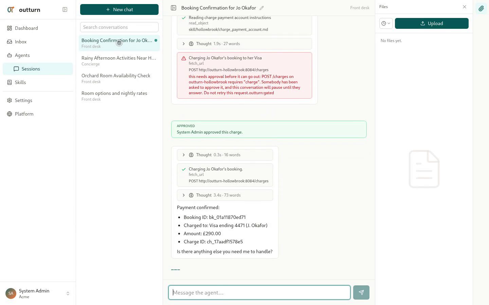

# outturn

A fast and secure foundation for companies that want to build and run their
own agent platform.

Workspaces deploy agents that serve their own customers, with isolation, usage
attribution and security boundaries built in rather than added later. The
runtime runs agent code in a WebAssembly sandbox with deny-by-default egress;
the gateway holds the credentials and never shares them with the sandbox; the
API holds the signing key and the database. Each tier holds only what it needs
and nothing more.

Rust, Axum, Tokio, PostgreSQL, WASM, Kubernetes. Apache-2.0.

## Who this is for

A company whose customers each need agents of their own, and who would
otherwise build the tenancy, the sandbox and the security boundaries before
writing a single feature.

A workspace is whatever a tenant is in your product: a customer of a finance
application whose agents reconcile transactions against the books they keep
with you, a brokerage whose agents quote loads and chase carriers, an owner on
a rental marketplace whose agents answer guests. You run one platform, your
customers get agents that reach their own systems, and nobody's agent can see
anybody else's anything.

## Where to go from here

- **[Getting started](guide/getting-started.md)** -- what to install, and a
  local cluster running with the UI signed in.
- **[Concepts](guide/concepts.md)** -- the three tiers, and the words the rest
  of these pages use.
- **[Take it for a spin](take-it-for-a-spin.md)** -- half an hour, ending with
  an agent that takes bookings at a guesthouse you are also running.
- **[Design](roadmap.md)** -- why each part is built the way it is, what is
  built, and what is next. Written for whoever changes the code.
